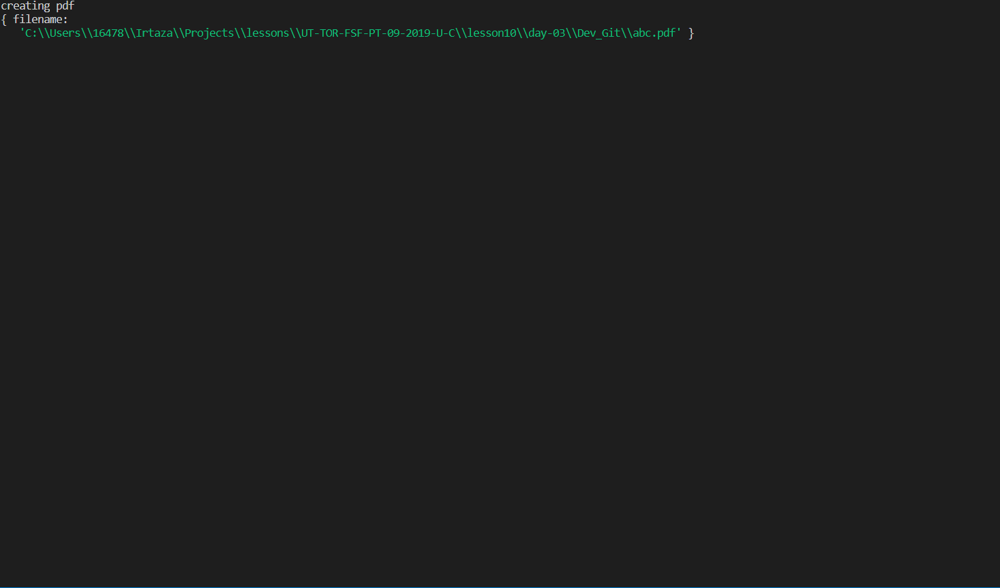

# Dev_Profile_Generator

This is a Developer profile Generator

## Installation
Git clone the repo on your local computer and run cli.js in Git bash shell

## Usage 
Go to open Bash 

Do NPM Install & press enter

 

Do npm install inquirer & press enter 

Do npm install cheerio & press enter

 

Do npm install html-pdf & press enter 

Write node cli

Answer the questions or press enter for default values

Pdf Created

View PDF 

 
